# 整潔架構 - ch5 物件導向程式設計

歷史小故事大家可以自己當故事看一下，這邊提到了關於物件導向通常都會具備三種特質，但現今的版本通常是四種（書上沒有提到關於抽象的不份）

物件導向四個特性：
1. 抽象（Abstraction）
2. 封裝（Encapsulation）
3. 繼承（Inheritance）
4. 多型（Polymorphism）

關於書中提到的封裝及繼承也有許多歷史小故事的部分，喜歡的可以去看看，這邊關於特性的解說我先跳過，因為網路上已經有太多寫得真的很棒的文章來解說這幾個特性了，這邊我們關注書中提到的比較有趣的部分：**多型**

## 依賴反向（Dependency Inversion）

或是有人翻譯為**依賴反轉**。

承前面提到的歷史小故事，以前使用多型是一件代價不小的事情，在安全及方便得多型機制可用前，軟體中的功能會透過典型的呼叫樹去實現。也就是高層模組的函式呼叫中層模組的函式，而中層模組的函式呼叫低層模組的函式，程式碼之間的依賴關係緊緊跟隨著控制流程。

然而，在多型的設計發揮作用時（你可以想像這些模組都 implement 某個 interface），原始碼之間的依賴關係會朝著 interface 去，與原本繼承關係的依賴方向相反，這就是所謂的依賴反轉（Dependency Inversion）。

事實上，OO 語言提供的安全寫方便的多型意味著，**無論在何處，任何程式碼的依賴方向都可以被反轉。**

而應用這種方式，我們面對以 OO 語言編寫的系統，就能夠**絕對控制**系統中所有原始碼的依賴方向。

而這種力量可以用來做什麼呢？舉例來說，你可以重新排列系統原始碼的依賴關係，以便資料庫及使用者介面依賴於業務邏輯。

```plantuml

@startuml

class "UI" 
hide "UI" methods
hide "UI" empty fields
hide "UI" circle

class "Businuss Rule"
hide "Businuss Rule" methods
hide "Businuss Rule" empty fields
hide "Businuss Rule" circle


class "Database"
hide "Database" methods
hide "Database" empty fields
hide "Database" circle


"UI" -right-|> "Businuss Rule"
"Database" -left-|> "Businuss Rule"

"UI" <.. "Businuss Rule"
"Database" <.. "Businuss Rule"

@enduml
```

這意味著，業務邏輯的程式碼不會提及 UI 或是資料庫，而這樣使得我們在架構上獲得幾個很棒的特點

1. 獨立部屬性(independent deployybility)
    - 當元件中的程式碼發生變化時，只需要重新部署該元件即可。 
3. 獨立開發(independent developability)
    - 既然可以獨立部署，那麼就可以由不同團隊獨立開發。

## 總結

對於軟體架構來說，我們可以使用 OO 透過多型來獲得系統中所有程式碼的依賴方向絕對控制權。
